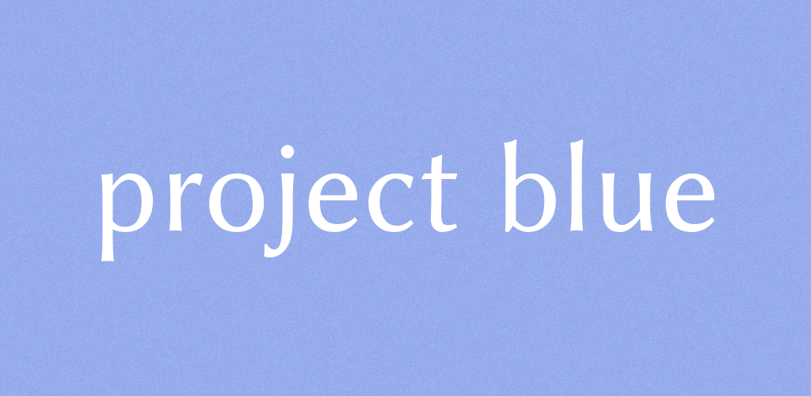

# project blue



project blue is an alternative, open source streaming music client for [JRiver Media Center](http://jriver.com/).

It's features include:

- Reliable streaming from your home server running JRiver Media Center
- Caching of audio files during playback
- Synchronize audio from a JRMC server to device
- Play local files when present and metadata match
- Updates server with now playing information
- Interfaces with Bluetooth remote control clients and Pebble watches
- Interfaces with apps that implement the Scrobble Droid interface (Simple Last.fm Scrobbler is my scrobbler of choice) for scrobbling to Last.fm or Libre.fm
- Intuitive layout

Download on the [Google Play Store](https://play.google.com/store/apps/details?id=com.lasthopesoftware.bluewater)

*Requires [JRiver Media Center](http://jriver.com/) running on your home server*

# Development


## Getting Started

These instructions will get you a copy of the project up and running on your local machine for development 
and testing purposes. See deployment for notes on how to deploy the project on a live system.

### Prerequisites

Java and the Android SDK are required to develop project blue. To perform a continuous integration (CI)
build, Docker and Docker Compose are required. To run a CI build, run the following command:

```shell script
./build.sh
```

### Installing

1. Clone this repository
2. Install Android Studio, along with the Android SDK
3. Build and run!

## Running the tests

Run the tests via the IDE.

## Deployment

Once changes are merged, a build will be deployed and published by myself, @danrien, the project blue maintainer.

## Built With

* [Gradle](https://maven.apache.org/) - Dependency Management
* [ROME](https://rometools.github.io/rome/) - Used to generate RSS Feeds

## Contributing

Finding issues and reporting them is contributing to making project blue better! Please submit any 
issues that are found in the issues area.

Folder structure is organized by *context*, or rather, it moves away from the "sock drawer" folder structure
that Android follows. It is inspired by this post on AngularJS project structure (another Google framework that
encourage sock drawer app structuring): http://cliffmeyers.com/blog/2013/4/21/code-organization-angularjs-javascript.
This means everything is logically grouped in nested folders based on feature. Unfortunately, some 
areas, such as the `res` folders, do not allow such structuring.

Please read [CONTRIBUTING.md](https://gist.github.com/PurpleBooth/b24679402957c63ec426) for more 
details on our code of conduct, and the process for submitting pull requests to us.

## Versioning

We use [SemVer](http://semver.org/) for versioning. For the versions available, see the 
[tags on this repository](https://github.com/namehillsoftware/projectBlue/tags). 

## Authors

- David Vedvick

## License

This project is licensed under the GNU Lesser General Public License v3.0 - see the [LICENSE](LICENSE) file for details

## Acknowledgments

* Hat tip to anyone whose code was used
* Inspiration
* etc
