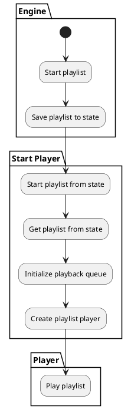
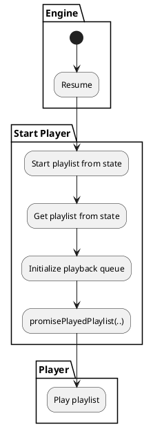

Engine ->
    - PlayableFile
    - Preparation ->
        - Queue ->
            - PreparedPlayableFileQueue
        - PlayableFilePreparationSource
        - PreparedPlayableFile
Playlist ->
    -> Play: PlayingPlaylist -> Future state
    -> Pause: PausedPlaylist -> Future state
    -> Resume: PlayingPlaylist -> Future state
    -> ChangePosition: 
    -> Add
    -> Remove
    -> Insert

Within a playback engine, two items need synchronization, but not necessarily with each other:

- The "player"
    - The "player" actively progresses through media and through a playlist
    - Do not want two different players active at once.
    - The player depends on the now playing data to start, to save current progress, etc.
- "Now Playing data"
    - The now playing data contains the list of media to play, and the last stored playback progress.

*Starting a new playlist*

*Restoring a playlist*

